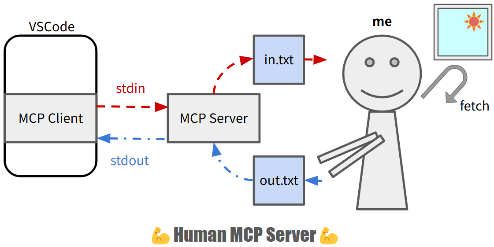

# humanmcp

YOU ARE THE MCP SERVER!



# Setup

- 1. build the server

```bash
go build
```

- 2. add the server to the settings of MCP host

```json5
// example: VSCode settings
"mcp": {
  "inputs": [],
  "servers": {
    "human-mcp": {
      "command": "path/to/humanmcp/executable",
      "args": [
      ],
      "env": {}
    }
  }
}
```

# Usage

This MCP server is **100% MANUAL**. Good luck.

- You read the requests from `in.txt`
- You write the responses to `out.txt`

```bash
# monitor requests from the client
$ tail -f in.txt
{"jsonrpc":"2.0","id":1,"method":"initialize","params":{"protocolVersion":"2024-11-05","capabilities":{"roots":{"listChanged":true}},"clientInfo":{"name":"Visual Studio Code","version":"1.99.2"}}}
{"method":"notifications/initialized","jsonrpc":"2.0"}
{"jsonrpc":"2.0","id":2,"method":"tools/list","params":{}}
{"jsonrpc":"2.0","id":3,"method":"tools/call","params":{"name":"get-japan-forecast","arguments":{"location":"Tokyo"}}}
```

```bash
# send responses back to the client
$ echo '{"result":{"protocolVersion":"2024-11-05","capabilities":{"tools":{}},"serverInfo":{"name":"humanmcp","version":"1.0.0","capabilities":{"resources":{},"tools":{}}}},"jsonrpc":"2.0","id":1}' > out.txt
$ echo '{"result":{"tools":[{"name":"get-japan-forecast","description":"Get weather forecast","inputSchema":{"type":"object","properties":{"location":{"type":"string","description":"location name"}},"required":["location"],"additionalProperties":false,"$schema":"http://json-schema.org/draft-07/schema#"}}]},"jsonrpc":"2.0","id":2}' > out.txt
$ echo '{"result":{"content":[{"type":"text","text":"sunny"}]},"jsonrpc":"2.0","id":3}' > out.txt
```
